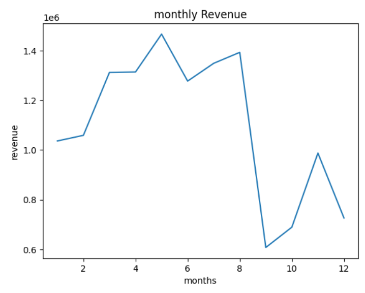
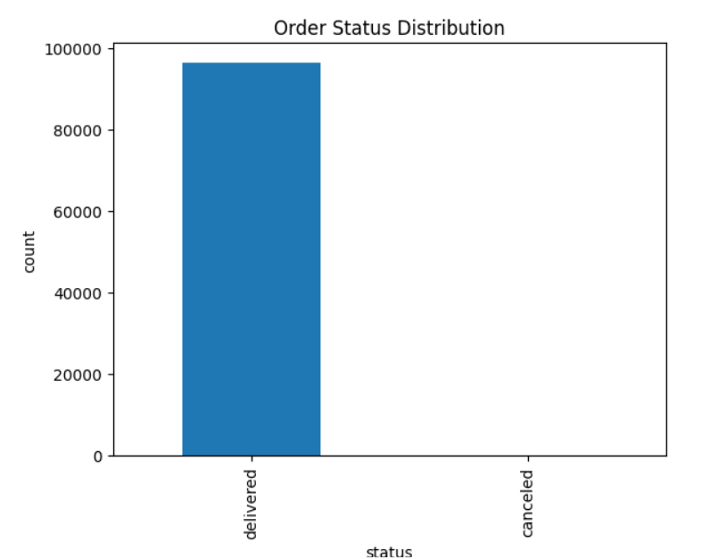
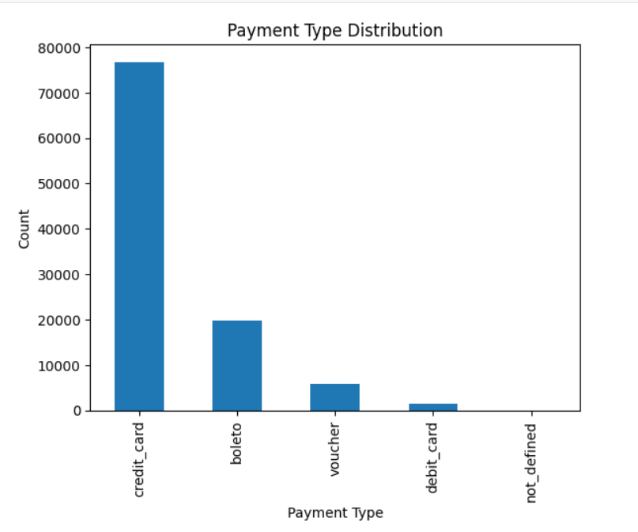
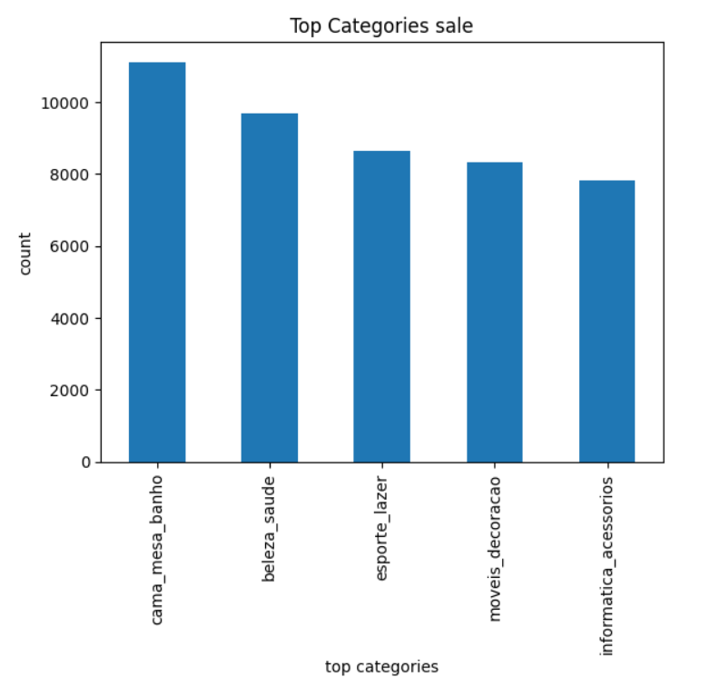

# E-Commerce Data Analysis Project

## 📌 Overview
This project analyzes e-commerce data to extract meaningful business insights such as sales trends, customer behavior, and product performance.

## 🛠️ Tools & Technologies
- Python
- Pandas
- NumPy
- Matplotlib / Seaborn
- Jupyter Notebook

## 📂 Project Structure
- raw_data → Original datasets  
- cleaned_data → Processed datasets  
- analysis_visualization → Analysis notebooks & visualizations  

## 📊 Key Insights
- Identified top-performing products  
- Analyzed monthly sales trends  
- Studied customer purchasing patterns  

## ▶️ How to Run
1. Install required libraries  
2. Open notebooks in Jupyter  
3. Run step-by-step  

## 📈 Results
This project helps understand business trends and supports data-driven decision-making.
## 📊 Visualizations

### monthly revenue

## order status distribution

## 📊 Visualizations

### Payment Distribution

### Top Sales Category

